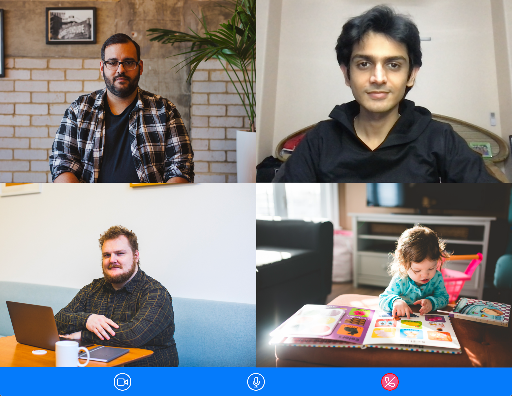
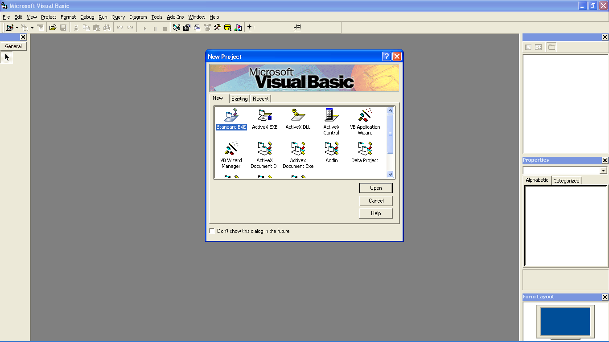
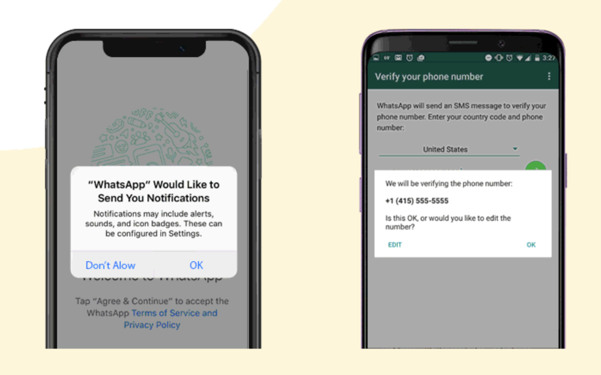

---
# try also 'default' to start simple
theme: geist
colorSchema: 'dark'
# background: https://source.unsplash.com/collection/94734566/1920x1080
# apply any windi css classes to the current slide
# class: 'text-center'
# https://sli.dev/custom/highlighters.html
highlighter: shiki
# show line numbers in code blocks
lineNumbers: false
# some information about the slides, markdown enabled
# info: |
#   ## Slidev Starter Template
#   Presentation slides for developers.

#   Learn more at [Sli.dev](https://sli.dev)
# persist drawings in exports and build
drawings:
  persist: false
---

# Low-Code for Developers

<br>

#### Building a low-code product that devs don't throw out in a week
<br><br><br><br><br>
<a href="https://twitter.com/ekaansh" target=_blank>@ekaansh</a>

---
layout: two-cols
---

<div style="display: flex; place-items: center;flex-direction:column"> 

# About me

<br>


### Ekaansh Arora

</div>

::right::
<br> <br> <br> <br>
<div style="display: flex; place-items: center;flex-direction:column"> 

- Developer Advocate, <a style="color: rgba(221, 221, 221)" href="https://agora.io" target=_blank>Agora​</a>

- JavaScript Nerd​

- Maintainer of Agora React (Native) UIKit​

- Maker of 3D art and taylor swift metal covers

<logos-twitter /> <a href="https://twitter.com/ekaansh" target=_blank>@ekaansh</a>
<span style="margin:10px"></span>
<fa-github /> <a href="https://github.com/ekaansharora" target=_blank>@ekaansharora</a>
</div>

---
clicks: 8
---

<div v-if="$slidev.nav.currentPage===3" v-motion
    :initial="{ x: 0, y: 10, opacity: 0}"
    :enter="{ x:0, y: 0, opacity: 1, }">

# What's low code
</div>

<div v-click=1 >
  <div v-if="$slidev.nav.clicks>0" v-motion
    :initial="{ x: 0, y: 0, opacity: 0}"
    :enter="{ x:0, y: -15, opacity: 1}">
    <h4 v-click="1"> Abstractions to simplify developer experience that let you focus on things that matter<h4 v-click="2" style="display:inline">++</h4></h4>
</div>
</div>
<div v-click=2 style="display:none"></div>
<v-clicks>

- #### > Assembly
- #### > High-level languages / Compilers
- #### > Frameworks
- #### > Low code?

</v-clicks>

<br>

<div style="display: flex; flex-direction: row; flex: 1; justify-content: space-around; align-items: center" v-click=7>
  
  
  
  
</div>

7" v-motion
  :initial="{ x: 0, y: 0, opacity: 0}"
  :enter="{ x:0, y: -15, opacity: 1}" src="images/logo-wp.png" style="width: 30%; height: 100%; margin: auto"/>

<!--  low code is umbrella term for everything from drag drop interfaces to frameworks that you need to write code -->
---
layout: two-cols
clicks: 4
---

<div v-if="$slidev.nav.currentPage===4" v-motion
    :initial="{ x: 0, y: 10, opacity: 0}"
    :enter="{ x:0, y: 0, opacity: 1, }">

# Why Low-Code
</div>

<br>

<div v-click="1">

#### “By 2024, low-code application development will be responsible for more than 65% of application development activity.” - Gartner's report

</div>
<br>
<div v-click="2">

#### "Wordpress is still king" - me <p style="display:inline" v-click="3"> (and everyone else)</p>

</div>

<div v-click="4">

WordPress is used by **43.2%** of all websites on the internet in **2022**, an increase from **39.5%** in 2021.

</div>

::right::
<div v-click="4">
  <tweet scale="0.7" style="margin-left: 40px; width: 120%" id="1507028477345558531" />
</div>

---

# What this talk is about

<br>

<v-clicks>

- ### > Thinking developer experience
- ### > Low-Code specific patterns
- ### > General API design patterns
- ### > Escape hatches

</v-clicks>

---

<div v-if="$slidev.nav.currentPage===6" v-motion
    :initial="{ x: 0, y: 10, opacity: 0}"
    :enter="{ x:0, y: 0, opacity: 1, }">


# Extensibility is **#0**

<tweet id="1123554129882705923" style="width: 50%"/>
</div>

<!-- all good low code tools let you write code, this avoids you hitting a road block, oh can't do this with low code. must throw away everything and then start fresh, that's the worst experience. this is what has been key for wordpress  -->
---
clicks: 6
---
<div v-if="$slidev.nav.currentPage===7" v-motion
    :initial="{ x: 0, y: 10, opacity: 0}"
    :enter="{ x:0, y: 0, opacity: 1, }">

# Access low-level code
</div>
<br>
<br>

<div v-if="$slidev.nav.clicks > 0 && $slidev.nav.clicks < 4">

```ts {1-2|6-7|all}
const lowCodeInstance = new LowCode(config);
lowCodeInstance.doSomethingEasy();

...

const sdkInstance = lowCodeInstance.getSDK();
sdkInstance.doSomethingLowCodeDoesNot();
```

</div>

<div v-click=4 >
<div v-if="$slidev.nav.clicks > 3" v-motion
    :initial="{ x: 0, y: -10, opacity: 0}"
    :enter="{ x:0, y:  0, opacity: 1, }">

```swift {0|0|0|1-4|6-7|all}
let sepiaFilter = CIFilter(name:"CISepiaTone")
sepiaFilter?.setValue(input, forKey: kCIInputImageKey)
sepiaFilter?.setValue(intensity, forKey: kCIInputIntensityKey)
return sepiaFilter?.outputImage
...
let rawdata = UnsafeMutablePointer<RGBAPixel>.allocate(capacity: width * height)
pixels = UnsafeMutableBufferPointer<RGBAPixel>(start: rawdata, count: width * height)
```
</div>
</div>

---

<div v-if="$slidev.nav.currentPage===8" v-motion
    :initial="{ x: 0, y: 10, opacity: 0}"
    :enter="{ x:0, y: 0, opacity: 1, }">

Access low-level code

```tsx
  <AgoraUIKit rtcProps={{appId: '<Agora App ID>', channel: 'test'}} />
```



<div v-click=1>

```ts
  const { client } = useContext(RtcContext)
  await client.enableVirtualBackground(config)
```
</div>
</div>

<!-- if the user needs virtual background that the uikit doesn't support we throw out the entire project unless.. -->

---
---

<h2 style="display:inline"> Smart defaults </h2>
<h4 v-click="1" style="display:inline">that are built to be overridden</h4>

<br>
<br>

<video loop="true" autoplay="autoplay" muted style="width: 100%; margin:auto">
  <source src="images/screen.webm" type="video/webm">
</video>

<!-- we're trying to do the users work for them, but you don't want to make decision on the user's behalf, so you add smart defaults that work out of the box but can be overridden simply-->

---
clicks: 1
---
## Granularity

<div v-click-hide=1>

```ts
> step a 
> step b
> step c
> step d
> step e
> step f
```

vs.

```ts
> step abcdef
```
</div>
<div v-click=1 >
  <div v-if="$slidev.nav.clicks>0" v-motion
    :initial="{ x: 0, y: -150, opacity: 0}"
    :enter="{ x:0, y: -200, opacity: 1, }">

```ts
> step abcd
> step ef
```

  </div>
</div>

---

## Give user access to events

```ts
> step e
event.emit("some-event-between-e-and-f") // can be blocking / non-blocking
> step f
```
<div v-click=1 >
  <div v-if="$slidev.nav.clicks>0" v-motion
    :initial="{ x: 0, y: 40, opacity: 0}"
    :enter="{ x:0, y: 20, opacity: 1, transition: { delay: 0 } }">

```ts {1|2|3|4}
> step abcd
doSomethingAfterEventD()
instance.on("some-event-between-e-and-f", doSomethingAfterEventE())
> step ef
```

  </div>
</div>

---

## Framework specific design

SwiftUI
```swift
image?.padding(100).resizable().scaledToFit()
```

React Library
```tsx{0|1|3}
<image padding="100" resizable scaled></image>
// vs.
<image style={{padding: "100px"}} resizable scaled></image>
```

<!-- user's already know the framework don't make them learn your syntax -->

---
clicks: 6
---

## Escape hatches

#### An “escape hatch” is an intentional leak in the abstraction layer. It allows users to “escape the abstraction” and reach out to a lower layer  - cdk8s docs



<div v-if="$slidev.nav.clicks>1 && $slidev.nav.clicks < 6">

```vb {0|1|2|3|4}
Msgbox "This is myName"
Msgbox "This is "myName""  ' This gives an error
Msgbox "This is ""myName"""
"This is \"myName\""
```
</div>
<div v-click="6">

```jsx
<div dangerouslySetInnerHTML={{__html: '<p>Hello World!</p>'}}></div>
```
</div>

<!-- removing guard rails and letting the user do things that would otherwise be impossible, this might lead to  -->

---
clicks: 5
---
## Taxonomy

<tweet v-if="$slidev.nav.clicks===0" id="1522312354653945857" />

<div v-click=1>

```swift {0|1-2|4-5|7-8|10-11|13-14}
x.append(y) //Nonmutating
let	z = x.appending(y) //Mutating

y.formUnion(z) //Mutating
x = y.union(z) //Nonmutating

array.remove(0) ⛔️
array.removeAt(0) ✅

view.removeElement(cancelButton) ⛔️
allViews.remove(cancelButton) ✅
```
</div>
<div v-click=5>

#### opinion: if in doubt, be as explicit as you can
</div>

---

## Docs, docs, docs
<v-clicks>

- \*looks at code\*
- i wonder who wrote this trash
- `git blame`
- EkaanshArora, 2 weeks ago

#### We has met the enemy, and it is us. — Walt Kelly


</v-clicks>


---

## Handle errors

<tweet v-if="$slidev.nav.clicks===0" id="1535987671868137472" scale="0.7" />
<v-clicks>

- #### > Descriptive error messages
- #### > Handle user errors
- #### > Use patterns to show functions that can error

</v-clicks>

<div v-click="4" v-if="$slidev.nav.clicks>3 && $slidev.nav.clicks<6" >

```ts {1-5|7}
try {
  data = methodThatCanError(badConfig)
} catch (e) {
  print(e)
}
...
let data = methodThatCanError(badConfig)
```
</div>
<div v-click="6">

```ts
let {data, error} = methodThatCanError(badConfig)
if (!error) print(data)
```
</div>

---

<h2 style="display:inline"> Pre built UI </h2>
<h4 v-click="1" style="display:inline"> - respect platform standards</h4>

<br>
<br>



---

## i18n use icons

👋 username,

---

## Use syntax / design the API to avoid user error

---

## Mobile Design

---

<tweet id=1534914416050855936 /> 

<!-- 
## Framework specific design

```go
package main
import ("fmt")
func main() {
  fmt.Print("hi mom")
}
```

```ts
console.log('hi mom')
```-->

---