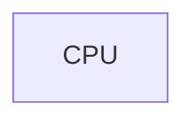
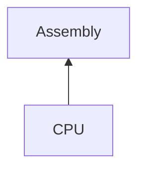
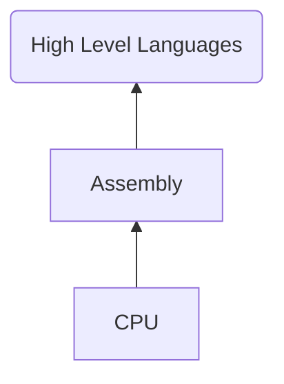
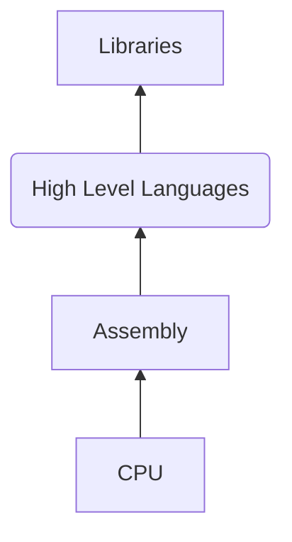
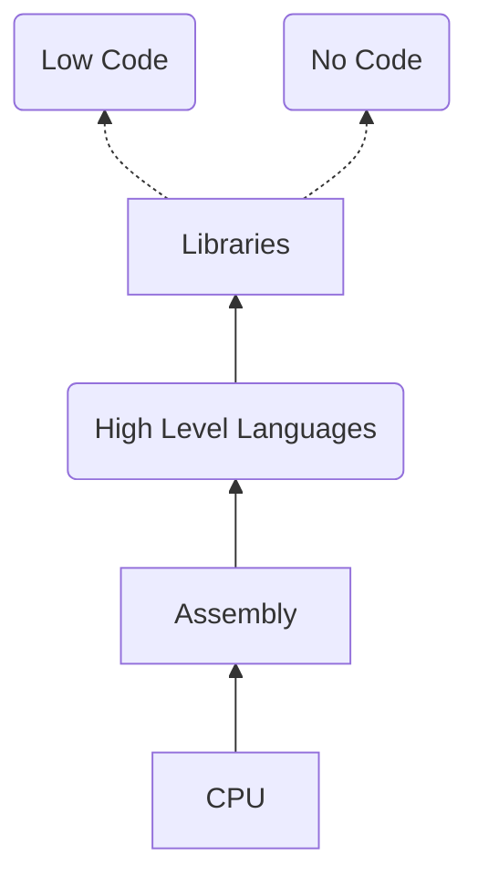

# Low-Code for React Developers

<br>

<!-- #### Building a low-code product that devs don't throw out in a week -->
<br><br><br><br><br>
<a href="https://twitter.com/ekaansh" target=_blank>@ekaansh</a>

---
layout: two-cols
---

<div style="display: flex; place-items: center;flex-direction:column"> 

# About me

<br>


### Ekaansh Arora

</div>

::right::
<br> <br> <br> <br>
<div style="display: flex; place-items: center;flex-direction:column"> 

- Developer Advocate, <a style="color: rgba(221, 221, 221)" href="https://agora.io" target=_blank>Agora​</a>

- JavaScript Nerd​

- Maintainer of Agora React (Native) UIKit​

- Maker of 3D art and taylor swift metal covers

<logos-twitter /> <a href="https://twitter.com/ekaansh" target=_blank>@ekaansh</a>
<span style="margin:10px"></span>
<fa-github /> <a href="https://github.com/ekaansharora" target=_blank>@ekaansharora</a>
</div>

---
clicks: 11
---

<div v-if="$slidev.nav.currentPage===3" v-motion
    :initial="{ x: 0, y: -20, opacity: 0}"
    :enter="{ x:0, y: -50, opacity: 1, }">

# What's low code
</div>

<div v-click=1 >
  <div v-if="$slidev.nav.clicks>0" v-motion
    :initial="{ x: 0, y: -20, opacity: 0}"
    :enter="{ x:0, y: -50, opacity: 1}">
    <h4 v-click="1"> Abstractions to simplify developer experience that let you focus on things that matter<h4 v-click="2" style="display:inline">++</h4></h4>
</div>
</div>
<div v-click=2 style="display:none"></div>

<div v-if="$slidev.nav.clicks>2 && $slidev.nav.clicks<8" style="position:relative; height: 32vh;display: flex;justify-content: center;">
<div style="position:absolute; bottom: -30px;">

<div v-if="$slidev.nav.clicks===3">


</div>
<div v-if="$slidev.nav.clicks===4">


</div>
<div v-if="$slidev.nav.clicks===5">


</div>
<div v-if="$slidev.nav.clicks===6">


</div>
<div v-if="$slidev.nav.clicks===7">


</div>
</div>
</div>

<div v-if="$slidev.nav.clicks===8 || $slidev.nav.clicks===9">

## Videocall = 1000s of lines of code
</div>
<div v-if="$slidev.nav.clicks===9">

```tsx
<AgoraUIKit config={config} style={style} callbacks={callbacks} />
```
</div>

<div style="display: flex; flex-direction: row; flex: 1; justify-content: space-around; align-items: center; margin-top: 100px" v-click=10>
  
  
  
  
</div>

10" v-motion
  :initial="{ x: 0, y: 0, opacity: 0}"
  :enter="{ x:0, y: -200, opacity: 1}" src="/images/logo-wp.png" style="width: 30%; height: 100%; margin: auto"/>

<!--  low code is umbrella term for everything from drag drop interfaces to frameworks that you need to write code -->
---
layout: two-cols
clicks: 4
---

<div v-if="$slidev.nav.currentPage===4" v-motion
    :initial="{ x: 0, y: 10, opacity: 0}"
    :enter="{ x:0, y: 0, opacity: 1, }">

# Why Low-Code
</div>

<br>

<div v-click="1">

#### “By 2024, low-code application development will be responsible for more than 65% of application development activity.” - Gartner's report

</div>
<br>
<div v-click="2">

#### "Wordpress is still king" - me <p style="display:inline" v-click="3"> (and everyone else)</p>

</div>

<div v-click="4">

WordPress is used by **43.2%** of all websites on the internet in **2022**, an increase from **39.5%** in 2021.

</div>

::right::
<div v-click="4">
  <tweet scale="0.7" style="margin-left: 40px; width: 120%" id="1507028477345558531" />
</div>

---
clicks: 1
---


<br />
<div v-if="$slidev.nav.clicks===0" style="width: 60%; margin: auto" v-motion
    :initial="{ x: 0, y: -130, opacity: 1}"
    :enter="{ x:0, y: -130, opacity: 1, }">

```js
lowCodeTool.doSomeMagic()
```

</div>

<div v-click=1 style="width: 60%; margin: auto" v-motion
    :initial="{ x: 0, y: -130, opacity: 0}"
    :enter="{ x:0, y: 0, opacity: 1, }">

```js
lowCodeTool.doSomeMagic()
// do some other magic???
```

</div>


---

<div v-if="$slidev.nav.currentPage===6" v-motion
    :initial="{ x: 0, y: 10, opacity: 0}"
    :enter="{ x:0, y: 0, opacity: 1, }">

# Extensibility is **#1**

<tweet id="1123554129882705923" />
</div>

<!-- all good low code tools let you write code, this avoids you hitting a road block, oh can't do this with low code. must throw away everything and then start fresh, that's the worst experience. this is what has been key for wordpress  -->

---

<div v-if="$slidev.nav.currentPage===7" v-motion
    :initial="{ x: 0, y: 10, opacity: 0}"
    :enter="{ x:0, y: -30, opacity: 1, }">

#### Extensibility

<div v-if="$slidev.nav.clicks===0">


</div>
<div v-click=1 style="width: 80%; height: 45vh; overflow: scroll; margin: auto" >

```tsx
  <GiftedChat
    messages={this.state.messages}
    onSend={this.onSend}
    loadEarlier={this.state.loadEarlier}
    onLoadEarlier={this.onLoadEarlier}
    isLoadingEarlier={this.state.isLoadingEarlier}
    parsePatterns={this.parsePatterns}
    user={user}
    scrollToBottom
    onLongPressAvatar={user => alert(JSON.stringify(user))}
    onPressAvatar={() => alert('short press')}
    onPress={() => {Alert.alert('Bubble pressed')}}
    onQuickReply={this.onQuickReply}
    keyboardShouldPersistTaps='never'
    renderAccessory={Platform.OS === 'web' ? null : this.renderAccessory}
    renderActions={this.renderCustomActions}
    renderBubble={this.renderBubble}
    renderSystemMessage={this.renderSystemMessage}
    renderCustomView={this.renderCustomView}
    renderSend={this.renderSend}
    quickReplyStyle={{ borderRadius: 2 }}
    quickReplyTextStyle={{fontWeight: '200'}}
    renderQuickReplySend={this.renderQuickReplySend}
    inverted={Platform.OS !== 'web'}
    timeTextStyle={{ left: { color: 'red' }, right: { color: 'yellow' } }}
    isTyping={this.state.isTyping}
    infiniteScroll
  />
```
</div>

<!-- ::right:: -->

</div>

---

<div v-if="$slidev.nav.currentPage===8" v-motion
    :initial="{ x: 0, y: -30, opacity: 1}"
    :enter="{ x:0, y: -30, opacity: 1, }">

#### Extensibility 

<div v-if="$slidev.nav.clicks===0" style="display: flex; flex-direction: row">
  <div>
    
    
  </div>
  <div>
    
  </div>
</div>


<div v-click=1>

```tsx
<LineChart
  width={500}
  height={300}
  data={data}
  margin={{top: 5}}
>
  <CartesianGrid strokeDasharray="3 3" />
  <XAxis dataKey="name" />
  <YAxis />
  <Tooltip />
  <Legend />
  <Line type="monotone" dataKey="pv" stroke="#8884d8" activeDot={{ r: 8 }} />
  <Line type="monotone" dataKey="uv" stroke="#82ca9d" />
</LineChart>
```
</div>

Composition is great

</div>

---

# Access low-level code

<div style="display: flex; flex-direction: row;" >
  
  
  <v-click>
  
  </v-click>
</div>
---

<div v-if="$slidev.nav.currentPage===10" v-motion
    :initial="{ x: 0, y: -30, opacity: 0}"
    :enter="{ x:0, y: -10, opacity: 1, }" style="margin-top: -10px">

#### Access low-level code


```jsx
import {Skia, BlendMode, SkiaView, useDrawCallback} from "@shopify/react-native-skia";
const paint = Skia.Paint();
paint.setAntiAlias(true);
paint.setBlendMode(BlendMode.Multiply);
 
export const HelloWorld = () => {
  const width = 256;
  const height = 256;
  const r = 92;
  const onDraw = useDrawCallback((canvas) => {
    const cyan = paint.copy();
    cyan.setColor(Skia.Color("cyan"));
    canvas.drawCircle(r, r, r, cyan);
    const magenta = paint.copy();
    magenta.setColor(Skia.Color("magenta"));
    canvas.drawCircle(width - r, r, r, magenta);
    const yellow = paint.copy();
    yellow.setColor(Skia.Color("yellow"));
    canvas.drawCircle(width/2, height - r, r, yellow);
  });
  return (
    <SkiaView style={{ flex: 1 }} onDraw={onDraw} />
  );
};
```
</div>

---

#### Access low-level code

```jsx
import {Canvas, Circle, Group} from "@shopify/react-native-skia";
 
export const HelloWorld = () => {
  const size = 256;
  const r = size * 0.33;
  return (
    <Canvas style={{ flex: 1 }}>
      <Group blendMode="multiply">
        <Circle cx={r} cy={r} r={r} color="cyan" />
        <Circle cx={size - r} cy={r} r={r} color="magenta" />
        <Circle
          cx={size/2}
          cy={size - r}
          r={r}
          color="yellow"
        />
      </Group>
    </Canvas>
  );
};
```
Framework specific design
---

#### Access low-level code

```jsx
import {Canvas, Circle, Group, Drawing, Skia} from "@shopify/react-native-skia";
 
export const HelloWorld = () => {
  const size = 256;
  const r = size * 0.33;
  return (
    <Canvas style={{ flex: 1 }}>
      <Group blendMode="multiply">
        <Drawing
          drawing={({ canvas, paint }) => {
            paint.setColor(Skia.Color("cyan"));
            canvas.drawCircle(r, r, r, paint);
            paint.setColor(Skia.Color("magenta"));
            canvas.drawCircle(size - r, r, r, paint);
            paint.setColor(Skia.Color("yellow"));
            canvas.drawCircle(size / 2, size - r, r, paint);
          }}
        />
      </Group>
    </Canvas>
  );
};
```

---

## Escape hatch

#### An intentional leak in the abstraction layer, let's you reach out to a lower layer

<v-click>

```jsx
<div dangerouslySetInnerHTML={{__html: '<p>Hello World!</p>'}}>
```

</v-click>

<!-- removing guard rails and letting the user do things that would otherwise be impossible, this might lead to  -->

---


<div v-if="$slidev.nav.currentPage===14" v-motion
    :initial="{ x: 0, y: 10, opacity: 0}"
    :enter="{ x:0, y: 0, opacity: 1, }" style="margin-top: 0px">

# Putting it together

```tsx
  <AgoraUIKit rtcProps={{appId: '<Agora App ID>', channel: 'test'}} />
```
<br />


</div>

---
clicks: 3
---

# Putting it together

<div>
<div v-if="$slidev.nav.clicks>=0">

```tsx
  <AgoraUIKit rtcProps={{appId: '<Agora App ID>', channel: 'test', layout: layout.GRID}} />
```

</div>

<div v-if="$slidev.nav.clicks===1">

```tsx
<PropsProvider value={props}>
  <RtcConfigure>
    <LocalUserContext>
      <GridVideo /> 
      <LocalControls />
    </LocalUserContext>
  </RtcConfigure>
</PropsProvider>
```
</div>

<div v-if="$slidev.nav.clicks>1">

```tsx
<PropsProvider value={props}>
  <RtcConfigure>
    <LocalUserContext>
      <GridVideo /> 
      <LocalAudioMute />
      <LocalVideoMute />
      <SwitchCamera />
    </LocalUserContext>
  </RtcConfigure>
</PropsProvider>
```
</div>

<div v-if="$slidev.nav.clicks>2">

```ts
  const { client } = useContext(RtcContext)
  await client.enableVirtualBackground(config)
```
</div>

</div>

<!-- if the user needs virtual background that the uikit doesn't support we throw out the entire project unless.. -->

---
clicks: 2
---

# Granularity

<div v-if="$slidev.nav.clicks === 0">

```ts
openCarDoor()
getInCar()
startEngine()
driveToReactIndia()
meetCoolDevs()
openCarDoor()
getInCar()
startEngine()
driveHome()
```

vs.

```ts
doReactIndiaStuff()
```
</div>
<div v-click="1">

```ts
travelTo(ReactIndia)
meetCoolDevs()
travelTo(Home)
```
</div>

<div v-click="2">
  
</div>

---

## Give user access to events

What if I want to do checkMirror between `getInCar()` & `startEngine()`?


<div v-click=1 >

```ts
// in your lib
getInCar()
event.emit("inside-the-car") // can be blocking / non-blocking
startEngine()
```
</div>
<div v-click=2 >
  <div v-if="$slidev.nav.clicks>0" v-motion
    :initial="{ x: 0, y: 40, opacity: 0}"
    :enter="{ x:0, y: 20, opacity: 1, transition: { delay: 0 } }">

```ts {1-2|3|4|5}
// in the app
instance.on("inside-the-car", checkMirror())
travelTo(ReactIndia)
meetCoolDevs()
travelTo(Home)
```

  </div>
</div>

---

## Give user access to events

```tsx
<AgoraUIKit
  rtcProps={{
    appId: appId,
    channel: props.channel,
  }}
  callbacks={{
    EndCall: () => { router.push('/') },
    userJoined: (user) => {toast.show(user)},
  }}
/>
```

---
clicks: 3
---

## Docs, docs, docs
<v-clicks>

- \*looks at code\*
- i wonder who wrote this trash
- `git blame`
- EkaanshArora, 2 weeks ago

#### We has met the enemy, and it is us. — Walt Kelly


</v-clicks>


---
clicks: 6
---
## Errors

<tweet v-if="$slidev.nav.clicks===0" id="1535987671868137472" scale="0.7" />
<div v-click=1>

- #### > Descriptive error messages, error codes, error description ELI5

- #### > Use good patterns to show functions that can error
</div>

<div v-click="2" v-if="$slidev.nav.clicks>2 && $slidev.nav.clicks<5" >

```ts{1-5|7}
try {
  data = methodThatCanError(badConfig)
} catch (e) {
  print(e)
}
...
let data = methodThatCanError(badConfig)
```
</div>
<div v-click="5">

```ts
let {data, error} = methodThatCanError(badConfig)
if (!error) print(data)
```
</div>

<div v-click="6">

- #### > use enums
</div>

---

<tweet id=1534914416050855936 /> 

---

## We're hosting [RTE 2022](https://rte2022.agora.io/?promo=Arora)!


---

<div style="display:flex;flex-direction: column; align-items: center">
<br>
<br>
<br>

# Thanks for your time!
<br>

## We have a booth, come say hi : )
<!-- #### Learn stupid things to build stupidder things -->
<br>

<logos-twitter /> <a href="https://twitter.com/ekaansh" target=_blank>@ekaansh</a>

</div>

---

# References

- [Agora Web UIKit](https://github.com/AgoraIO-Community/Web-React-UIKit/)
- [Gartner Report](https://cyclr.com/blog/low-code-is-revolutionising-the-software-industry)
- [Swyx Twitter](https://twitter.com/swyx)
- [xkcd comic](https://xkcd.com/)
- [Giphy gif](https://giphy.com/)
